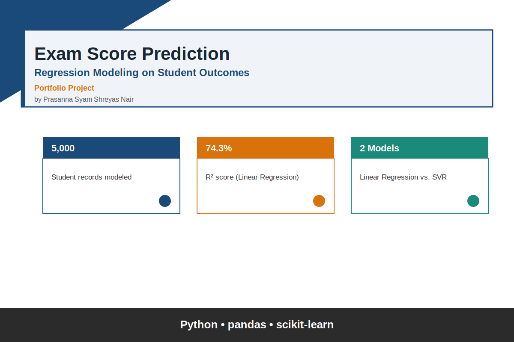
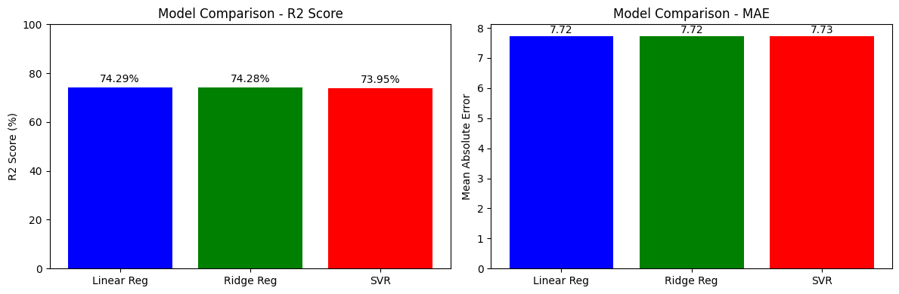
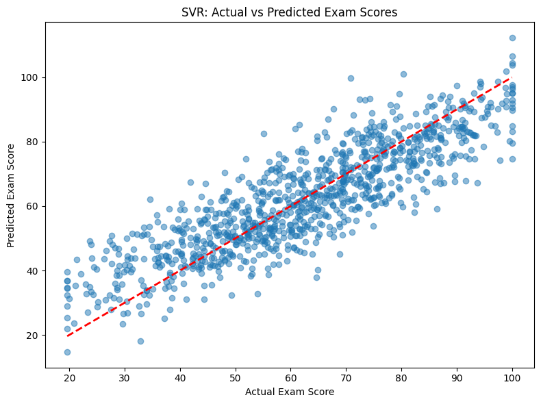
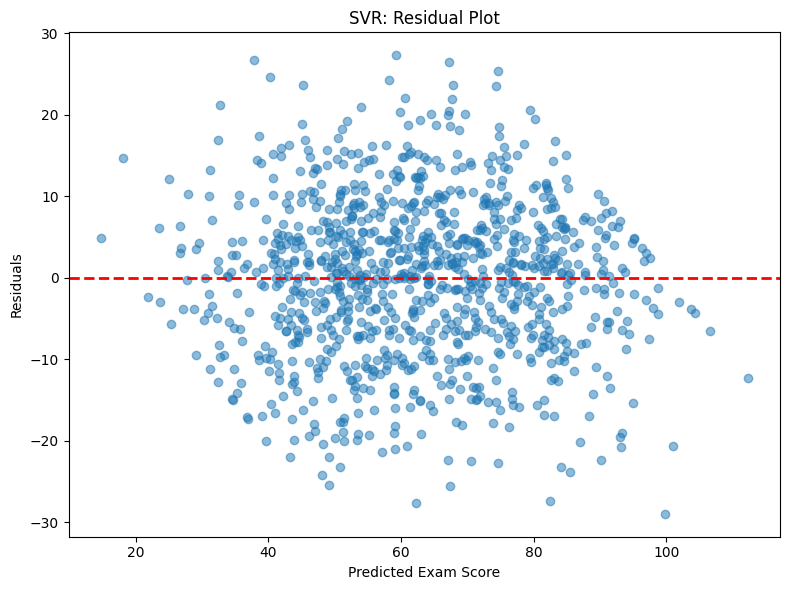

# Exam Score Prediction — Regression Models

Predicting student exam scores from academic and lifestyle factors using Linear Regression and Support Vector Regression (SVR).

## Dataset

20,000 student records with 11 attributes spanning demographics, education, and lifestyle (age, study hours, attendance, sleep hours, gender, course, study method, etc.). A 5,000-record subset is used for faster training while preserving the original distribution. `Exam_Score_Prediction.csv` is included so the notebook runs end-to-end with no external setup.

## Approach
- Feature encoding for categorical variables
- Standardization of numeric features
- Linear Regression vs. SVR comparison
- Hyperparameter tuning via `GridSearchCV`
- Cross-validation to guard against overfitting

## Results
Linear and Ridge Regression both land around 74% R², narrowly ahead of SVR:

The SVR model's predictions track closely with actual scores, with residuals centered around zero and no strong bias pattern:

  
  

## Tech
Python, pandas, scikit-learn
